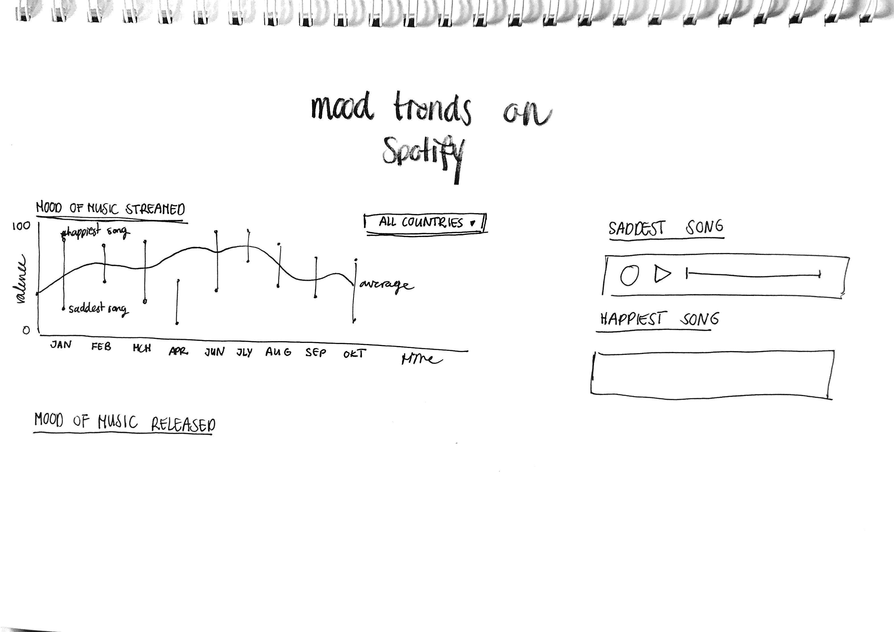

for **Fundamentals of Data Science** @HU

# Spotify Mood Dashboard

The Economist wrote the following article on February 8, 2020: "Data from Spotify suggests listeners are the most gloomy in February." The article described how an analysis of Spotify data suggests that, on average, July is the happiest listening month and the most popular tunes in February will be the most depressing ones. By analyzing data from different sources I want to discover what the effect of COVID-19 has on our listening behaviour and our mood.

Spotify has an algorithm that classifies a song’s **“valence”**, or how happy it sounds, on a scale from 0 to 100. The algorithm is trained on ratings of positivity by musical experts, and gives Aretha Franklin’s soaring “Respect” a score of 97; Radiohead’s gloomy “Creep” gets just 10 (The Economist, 2020).

Since 2017 Spotify has also published daily and weekly tables of the 200 most-streamed songs, both worldwide and in each country on [Spotify Charts](https://spotifycharts.com/regional).

- npm & fds koppeling

## Data Sources

### Spotify API

Spotify has an algorithm that classifies a song’s **“valence”**, or how happy it sounds, on a scale from 0 to 100. The algorithm is trained on ratings of positivity by musical experts, and gives Aretha Franklin’s soaring “Respect” a score of 97; Radiohead’s gloomy “Creep” gets just 10 (The Economist, 2020).

### Spotify Charts

Since 2017 Spotify has also published daily and weekly tables of the 200 most-streamed songs, both worldwide and in each country on [Spotify Charts](https://spotifycharts.com/regional).

## Theoretical Framework

### Scraping Spotify Charts

I use the Spotify Charts website to find out which songs most people are listening to since 2017. I need to scrape the website to get the data I need. A developer, @hktosun, has built a scraper (see [Spotify_WebScraper.py](https://gist.github.com/hktosun/d4f98488cb8f005214acd12296506f48)) in Python for this website before. I tweaked the code a bit (see [spotify-charts-scraper.py](https://github.com/sterrevangeest/spotify-dashboard/blob/master/spotify-charts-scraper.py)) to get all the necessary data.

The following information is retrieved from the website and exported to a `.csv` file:

| Song                                          | Artist                | Date       | Streams    | Url                                                   | Rank |
| --------------------------------------------- | --------------------- | ---------- | ---------- | ----------------------------------------------------- | ---- |
| Sunflower - Spider-Man: Into the Spider-Verse | Post Malone, Swae Lee | 2019-01-04 | 32,548,077 | https://open.spotify.com/track/3KkXRkHbMCARz0aVfEt68P | 1    |
| thank u, next                                 | Ariana Grande         | 2019-01-04 | 29,904,412 | https://open.spotify.com/track/2rPE9A1vEgShuZxxzR2tZH | 2    |

**etc...** (see [data/2019global.csv](https://github.com/sterrevangeest/spotify-dashboard/blob/master/data/2019global.csv) and [data/2020global.csv](https://github.com/sterrevangeest/spotify-dashboard/blob/master/data/2020global.csv) for the whole dataset).

**Unique Track Ids**

Sometimes the same tracks appear in a number of consecutive weeks. In order to not make unnecessary requests to the Spotify API, I only use unique numbers. The unique track IDs are then stored per 100 in an object. Because a request can be made per 100 IDs (see [unique-track-ids.py](https://github.com/sterrevangeest/spotify-dashboard/blob/master/unique-track-ids.py)).

### Spotify Api

I can retrieve the audio features from a track from the Spotify Api by using the url of the song (see [spotify-api.py](https://github.com/sterrevangeest/spotify-dashboard/blob/master/spotify-api.py)). The most important value for me will be the valence value: a measure from 0.0 to 1.0 describing the musical positiveness conveyed by a track. Tracks with high valence sound more positive (e.g. happy, cheerful, euphoric), while tracks with low valence sound more negative (e.g. sad, depressed, angry)(Get Audio Features for a Track | Spotify for Developers, n.d.).

```
GET https://api.spotify.com/v1/audio-features/{id}
```

The API will return the following:

```json
{
 "duration_ms": 255349,
 "key": 5,
 "mode": 0,
 "time_signature": 4,
 "acousticness": 0.514,
 "danceability": 0.735,
 "energy": 0.578,
 "instrumentalness": 0.0902,
 "liveness": 0.159,
 "loudness": -11.84,
 "speechiness": 0.0461,
 "valence": 0.624,
 "tempo": 98.002,
 "id": "06AKEBrKUckW0KREUWRnvT",
 "uri": "spotify:track:06AKEBrKUckW0KREUWRnvT",
 "track_href": "https://api.spotify.com/v1/tracks/06AKEBrKUckW0KREUWRnvT",
 "analysis_url": "https://api.spotify.com/v1/audio-analysis/06AKEBrKUckW0KREUWRnvT",
 "type": "audio_features"
}
```

**Combine all the data**

In [create-complete.py](https://github.com/sterrevangeest/spotify-dashboard/blob/master/create-complete.py) I combine all the data into one big dataset, see [data/complete.py](https://github.com/sterrevangeest/spotify-dashboard/blob/master/data/complete.csv).

### Creating the dashboard

- modules

### Result

### Skills & obstacles

For creating the dashboard I need to dive deeper into Dash and Plotly. In the previous assignments we created relatively simple charts and graphs. It may become a bit more challenging now that that have a lot more data to plot.

I have to make a lot of requests to get all the valance values for every track from the Spotify Api. I check if there is a request limit. When developing the dashboard it may be useful to use some mock data.

💃

<!-- ### Design



-->

---

### References

Get Audio Features for a Track | Spotify for Developers. (n.d.). Spotify for Developers. Retrieved 12 October 2020, from https://developer.spotify.com/documentation/web-api/reference/tracks/get-audio-features/

The Economist. (2020, February 6). Data from Spotify suggest that listeners are gloomiest in February. https://www.economist.com/graphic-detail/2020/02/08/data-from-spotify-suggest-that-listeners-are-gloomiest-in-february
